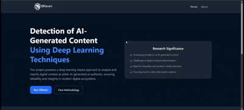

<big><big><b>🧠 A Decision Support System for AI Content Detection</b></big></big>

<!-- 🌐 RESEARCH PAPER --> 
##  Research Paper

### **Publishing Soon at CICBA-2026**

📄 **Paper:** `Coming Soon`

🌐 **Conference:** [CICBA-2026](https://www.cicba.in/)

> The paper link will be added here once officially published.

<!-- Demo -->
##  Demo

  

<!-- 🌐 Overall Arch --> 

## 🏗️ Overall Architecture

The system processes a PDF through separate **text and image analysis pipelines**, followed by an adaptive late-fusion layer to generate an overall AI probability score.

<!-- 🌐 Text Analysis --> 
## 📝 Text Analysis

The text module combines:

- **TF-IDF + Logistic Regression**
- **TF-IDF + Multinomial Naive Bayes**
- **Stylometric Features + Random Forest**
- **Neural Network Meta-Learner**

### 📊 Text Module Performance

**99.10% Accuracy | 99.97% AUROC**

<!-- 🌐 PDF BIFUECATION --> 
## 🖼️ PDF Bifurcation

The PDF processor separates the document into:

**Text → Text Detection Module**

**Images → Image Detection Module**

### 🔗 PDF Processor

[PDF Processor Repository](https://github.com/Anubrata-Mallick/PDF_PROCESSOR)

<!-- 🌐 Score --> 
## ⚡ AI Score Fusion

The text and image predictions are combined using an **adaptive late-fusion strategy** to produce the final document-level AI score.

<!-- 🌐 Test Result --> 
## 🧪 Test Results

The system was evaluated on adversarial cases, mixed text-image documents, and real academic project reports.

<!-- 🌐 My contri --> 

#  My Contribution

### 🚀 Engineering the Pipeline from Architecture to Validation

  <em>
    My work focused on designing, developing, integrating, and validating
     
    the core AI pipeline behind the project.
  </em>

 

---

### 🏗️ 01 · System Architecture

> Designed the **overall architecture** for efficient AI-based tracking while optimizing the system for operation within a constrained space.

---

### 📄 02 · PDF Bifurcation Pipeline

> Developed the **PDF bifurcation pipeline** to intelligently separate **text and images** from PDF documents, creating structured inputs for downstream AI processing.

---

### 🧠 03 · Ensemble AI Architecture

> Designed an **ensemble architecture** integrated with a **neural-network decision head** for robust text detection and intelligent model-level decision making.

---

### 🎯 04 · AI Score Fusion

> Developed the **fusion formula** responsible for generating the overall **AI score prediction**, together with its corresponding probability.

---

### 🧪 05 · Testing & Edge Cases

> Designed and conducted **comprehensive testing** of the fused model, systematically evaluating performance across different scenarios, edge cases, and failure conditions.

<!-- 🌐 Shout out --> 

#  Shoutouts 
🤝 The People Behind the Journey

 <em> People I had the pleasure of working with throughout the entire journey —   from the initial idea 💡 to the final publication 🚀 </em> 

 

<table align="center"> <tr> <td align="center" width="50%"> <h3>🌟 Shreya Dhar</h3> 
 <strong>Team Member</strong> 
  </td> <td align="center" width="50%"> <h3>🌟 Kartick Kumar Shaw</h3> 
 <strong>Team Member</strong> 
  </td> </tr> <tr> <td align="center" width="50%"> <h3>🌟 Karma Tashi Gyatsho Bhutiya</h3> 
 <strong>Team Member</strong> 
  </td> <td align="center" width="50%"> <h3>🧭 Indrajit Bhattacharya</h3> 
 <strong>Mentor</strong> 
  </td> </tr> </table>
---

⭐ **If you find the project interesting, consider starring the repository!**

