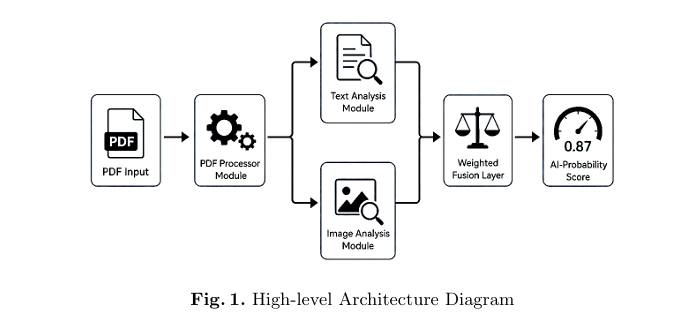
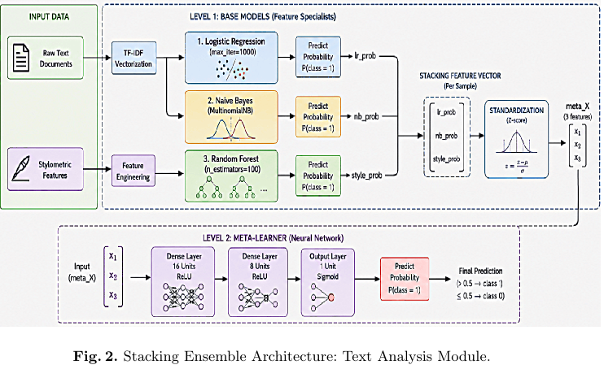
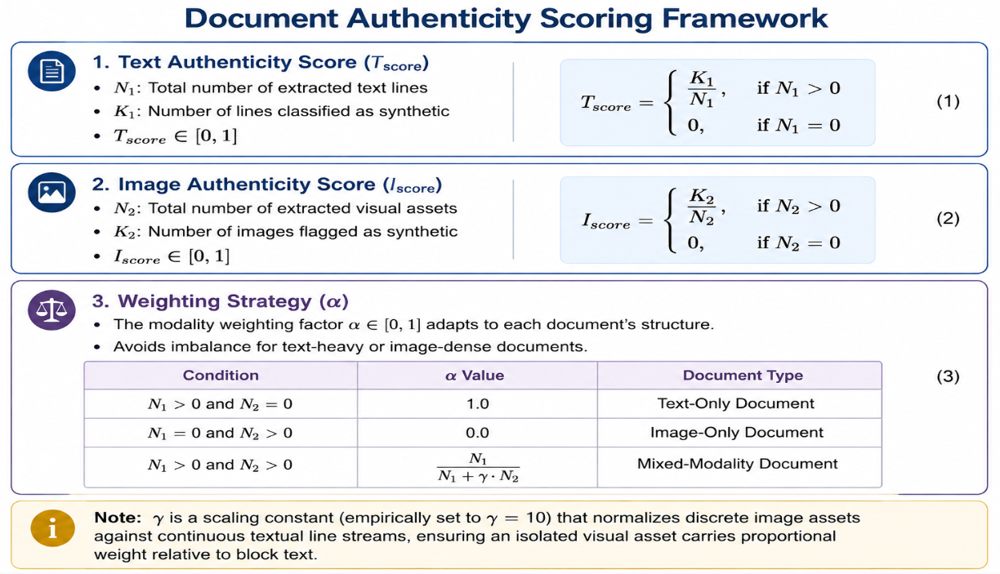
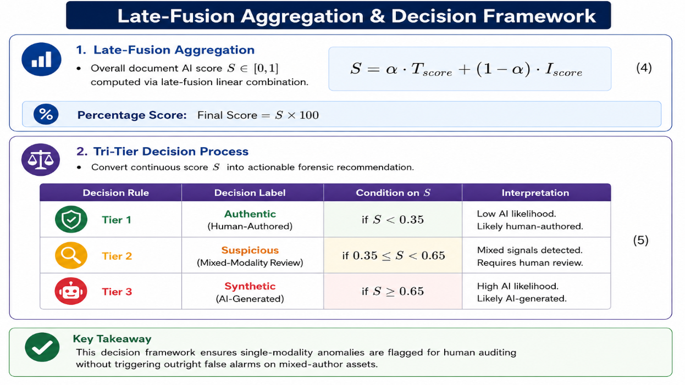
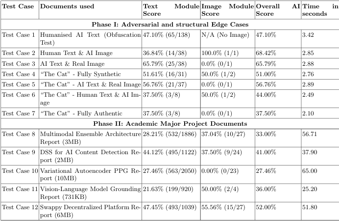

# 🧠 A Decision Support System for AI Content Detection

### Using Neural Networks & Ensemble Architecture

8th International Conference on Computational Intelligence in Communications and Business Analytics ([CICBA-2026](https://www.cicba.in/))

---

## 📢 Research Paper

### **Publishing Soon at CICBA-2026**

📄 **Paper:** `Coming Soon`

🌐 **Conference:** [CICBA-2026](https://www.cicba.in/)

> The paper link will be added here once officially published.

---

## 🎥 Demo

<video src="./assets/demo.mp4" controls width="800"></video>

---

## 🏗️ Overall Architecture

The system processes a PDF through separate **text and image analysis pipelines**, followed by an adaptive late-fusion layer to generate an overall AI probability score.

---

## 📝 Text Analysis

The text module combines:

- **TF-IDF + Logistic Regression**
- **TF-IDF + Multinomial Naive Bayes**
- **Stylometric Features + Random Forest**
- **Neural Network Meta-Learner**

### 📊 Text Module Performance

**99.10% Accuracy | 99.97% AUROC**

---

## 🖼️ PDF Bifurcation

The PDF processor separates the document into:

**Text → Text Detection Module**

**Images → Image Detection Module**

### 🔗 PDF Processor

[PDF Processor Repository](https://github.com/Anubrata-Mallick/PDF_PROCESSOR)

---

## ⚡ AI Score Fusion

The text and image predictions are combined using an **adaptive late-fusion strategy** to produce the final document-level AI score.

---

## 🧪 Test Results

The system was evaluated on adversarial cases, mixed text-image documents, and real academic project reports.

---

# My Contribution 👨‍💻

- Designed the overall architecture for efficient AI-based tracking in an optimized space.
- Developed the PDF bifurcation pipeline to separate text and images from PDF documents.
- Designed an ensemble architecture integrated with a neural network decision head for text detection.
- Developed the fusion formula to generate the overall AI score prediction along with the probability.
- Designed and conducted comprehensive testing of the overall fused model, covering various edge cases.

---

## 📚 Publication

**A Decision Support System for AI Content Detection Using Neural Networks and Ensemble Architecture**

**CICBA-2026**

📄 **Paper:** `Coming Soon`

🌐 [CICBA Official Website](https://www.cicba.in/)

---

⭐ **If you find the project interesting, consider starring the repository!**

